- Table of Contents
  {:toc}

---

## **Setting up, getting started**

Refer to the guide [_Setting up and getting started_](SettingUp.md).

---

## **Appendix: Requirements**

### Product scope

**Target user profile**:

- NUS students
- has a hard time organising and planning what modules to take
- prefer desktop apps over phone apps
- can type fast
- prefers typing to mouse interactions
- is reasonably comfortable using CLI apps
- want to have a good way to check all MCs
- wants to have a good way to check all fulfilled pre-requisites
- wants to have a good way to plan for all their modules

**Value proposition**:

- managing study plan is much easier than existing choices (i.e. WHAT-IF report)
- planning for modules is more automatic/convenient than manual inputs (NUSMOD)

### User stories

Priorities: High (must have) - `* * *`, Medium (nice to have) - `* *`, Low (unlikely to have) - `*`

| Priority | As a …​           | I can …​                            | So that I can…​                                                        |
| -------- | ----------------- | ----------------------------------- | ---------------------------------------------------------------------- |
| `* * *`  | new user          | see usage instructions              | refer to instructions when I forget how to use the App                 |
| `* * *`  | student user      | have multiple study plans           | prepare for different study scenarios in university                    |
| `* * *`  | student user      | add multiple semesters to a plan    | create plans that involve multiple semesters                           |
| `* * *`  | student user      | add multiple modules to a semester  | plan for what modules i want to do in a given semester                 |
| `* * *`  | student user      | delete a study plan                 | remove plans that i no longer need                                     |
| `* * *`  | student user      | delete a semester from a plan       | remove semesters that i no longer need                                 |
| `* * *`  | student user      | delete a module from a semester     | remove modules that i no longer need                                   |
| `* * *`  | student user      | view summary information of a plan  | conveniently understand the plan without having to open it             |
| `* *`    | student user      | check if my plan contains 160MCs    | know whether my plan allows me to graduate                             |
| `* * *`  | student user      | view a module's prerequisites       | know what modules need to be done before hand                          |
| `* *`    | student user      | mark semesters as done              | advance my study plan according to the semesters that i have completed |
| `*`      | forgetful student | add and view grades of past modules | keep track of how well i did for different modules without remembering |

### Use cases

(For all use cases below, the **System** is the `NUS Module Planner` and the **Actor** is the `user`, unless specified otherwise)

**Use case: Add a plan**

**MSS**

1.  User requests to add a plan
2.  AddressBook shows result

    Use case ends.

**Extensions**

- 2a. The given plan number already exists.

  - 2a1. AddressBook shows an error message.

  Use case ends.

- 3a. The given plan number is invalid.

  - 3a1. AddressBook shows an error message.

  Use case ends.

**Use case: Delete a plan**

**MSS**

1.  User requests to list plans
2.  AddressBook shows a list of plans
3.  User requests to delete a specific plan in the list
4.  AddressBook deletes the plan

    Use case ends.

**Extensions**

- 2a. The list is empty.

  Use case ends.

- 3a. The given index is invalid.

  - 3a1. AddressBook shows an error message.

    Use case resumes at step 2.

**Use case: Add a module to semester**

**MSS**

1.  User requests to add a module
2.  AddressBook shows result

    Use case ends.

**Extensions**

- 2a. The given module number is already added.

  - 2a1. AddressBook shows an error message.

  Use case ends.

- 3a. The given plan/semester number does not exist.

  - 3a1. AddressBook shows an error message.

  Use case ends.

- 4a. The given module number does not exist.

  - 4a1. AddressBook shows an error message.

  Use case ends.

- 5a. The given module number does not have its prerequisites met.

  - 3a1. AddressBook shows a warning prompt.

  Use case ends.

## **Implementation**
This section describes some noteworthy details on how certain features are implemented.

<<<<<<< HEAD
### Add Module to Semester Feature
#### Implementation
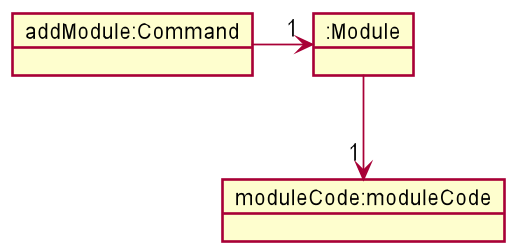

The addm command makes use of the Module class to add a module to the user's choice of plan and semester.
The user must provide a valid Plan Number, Semester Number and Module Code, otherwise they will be prompted to do so.
Here, if the user input the module with grade behind, model will note down the grade and use the grade to calculate user's CAP
Otherwise, the module will be mark as undone.

Constructor: Plan#new(String ModuleCode, String ModuleTitle, int MCs, <optional> String grade)
Creates a module object with the given module code, module title, MCs and grade if provided.

#### Overview: Add Plan command
The following presents a final overview of how the addm command is used:

=======
### Add Plan feature

#### Implementation

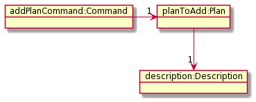

The `addp` command makes use of the `Plan` class to add a plan to the user's list of plans. The user must provide a valid `Description` for the plan, otherwise they will be prompted to do so.

##### Constructor:`Plan#new(Description description, Set<tag> tags, List<Semester> semesters)`
Creates a `Plan` object using the plan's `description`, its relevant `tags` as well as a list of `semesters` to include.
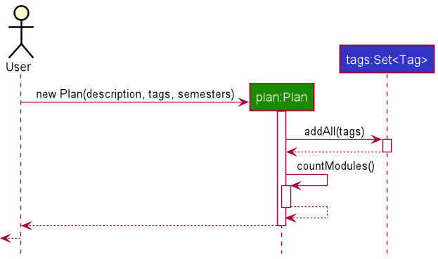

##### Method:`Plan#toString()`
Builds a formatted string by appending the plan's descriptions as well as all of its tags.
The `getDescription` method is used to obtain the Description in `String` format.
Each Tag's `toString()` method is called.
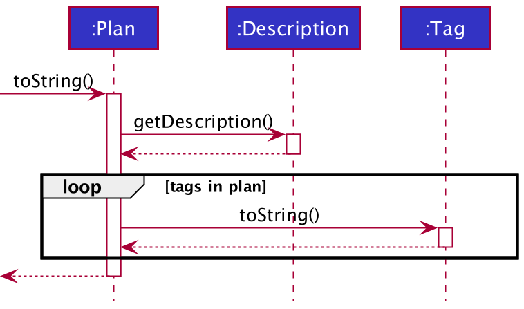

##### Overview: Add Plan command
The following presents a final overview of how the `addp command` is used:

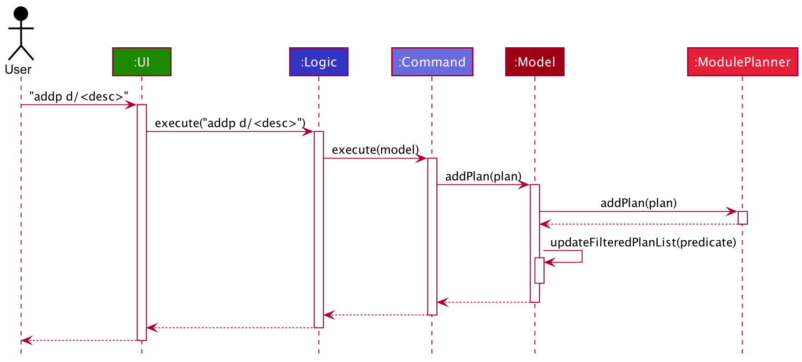

Do note that the current implementation always creates a new `Plan` instance whenever the `addp command` is provided by the user, to ensure that users create a new plan.

### History feature

#### Implementation

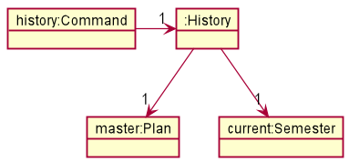

The `history command` makes use of the `History` class to format information about semesters prior to the users `current semester` in their `master plan`. As such, a precondition for the `history command` is that the user must have identified both a `master plan` and `current semester`, otherwise they will be prompted to do so.

The `History` class is a helper class that extends `HashMap` and implements two methods, a constructor and a `toString` method. The following explains the functionality that each method provides and how they are implemented:

##### Constructor:`History#new(Plan p, Semester current)`
Creates a `History` object (a subclass of `HashMap`) using information about semesters from the Plan `p` up until the `current` semester. The *keys* to the `HashMap` are the prior semesters each corresponding *value* is a List of modules that were done in that semester.
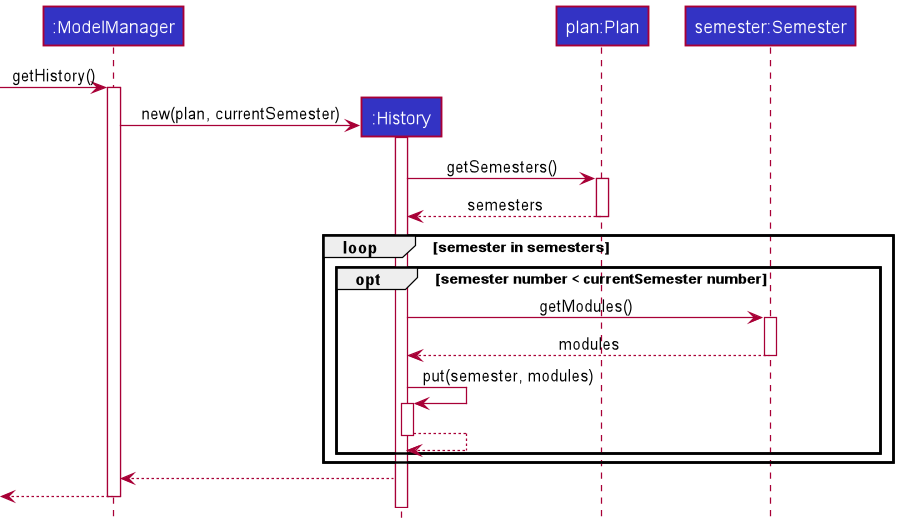

##### Method:`History#toString()`
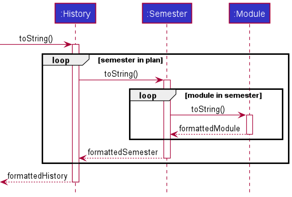

Builds a formatted string by iterating over each of the semesters stored as keys in the HashMap according to their semester number and in ascending order.

Each semester's `toString()` method is called which internally calls each modules `toString()` method.

##### Overview: History command
The following presents a final overview of how the `history command` is used:

Do note that the current implementation always creates a new `History` instance whenever the `history command` is provided by the user, to ensure that users are presented with their most updated information.

### Validate feature

The `validate` command looks at all modules from the `master` plan, specifically all semesters from the first to `current`. Every other plan is then looked at the same way up to whatever semester that `current` is set to. For example, if `current` is set to semester 5, validate takes the first 5 semesters of modules from the master plan and compares it to every other plan. If the other plans have every module that was found in the master plan, it is valid.

#### Implementation

##### Overview: Validate command

The `validate` command makes use of the `ModelManager` class which contains the necessary list of `plan` objects, which contains the relevant `semester` and `module` objects. After accessing the ValidateCommand logic component, if `master` and `current` is set, the `ModelManager` is accessed.

##### State Diagrams

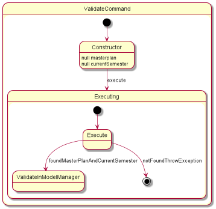

The `validate` command does not create other objects. It initializes with a null `masterPlan` and `currentSemester`, and updates them in the `execute()` method, throwing exceptions if they have not yet been set. If set successfully, validation continues.

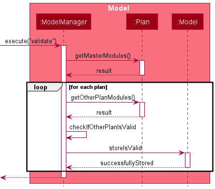

In the `ModelManager`, the `validate(masterPlan, currentSemester)` method references every other existing `Plan` from the base master plan. The method then sets whether or not they are valid.

##### [Proposed] Validating using History object

Currently validate checks each plan up to their semesters for the taken modules. This is rather slow since it has to loop through the modules. This can be done much faster using the `HashTable` which is provided by the `History` object. Although not currently a necessary feature since only a single user uses the application, this is a rather simple optimization that should be implemented.
=======
### Info feature

#### Implementation

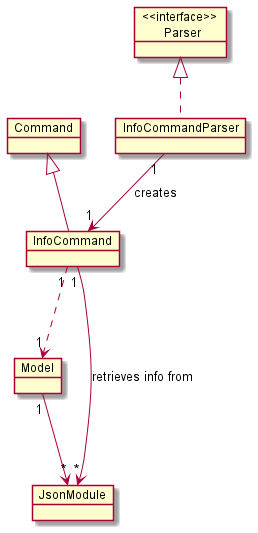

The `InfoCommandParser` reads the user input and creates a `InfoCommand` to execute with the any arguments found.
The `InfoCommand` makes use of the `JsonModule` class to retrieve module information stored in json format to
display relevant information to the user.

#### InfoCommandParser
#### Method:`parse(String args)`

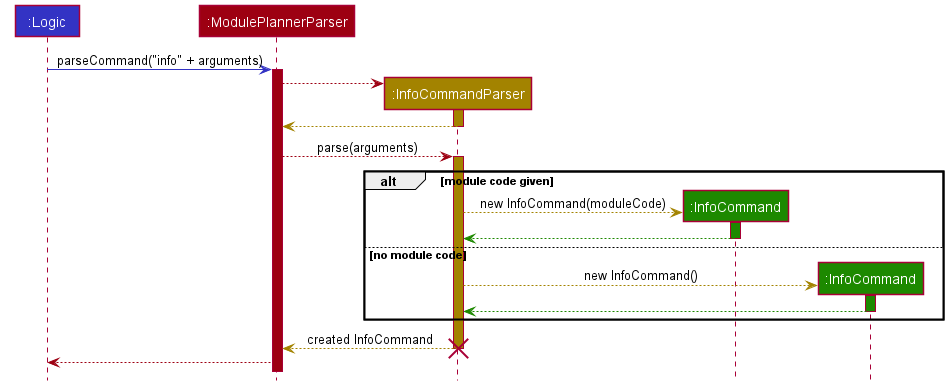

After `ModulePlannerParser` removes the command word from the user input, `InfoCommandParser`
extracts the module code if found and creates an `InfoCommand` object with the module code otherwise
an `InfoCommand` object with no module code.
The created `InfoCommand` object is returned to `Logic` object for execution.

#### InfoCommand
#### Method: `execute(Model model)`

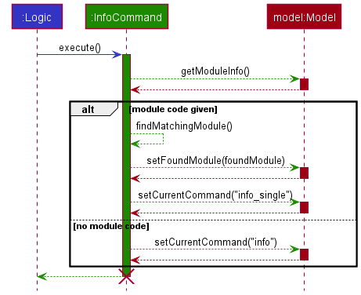

`InfoCommand` object retrieves all module information from `Model` object stored in `JsonModule`
object. Based on what arguments the `InfoCommand` object is created with, it finds the relevant
`JsonModule` object and sets it for the `Model` object `foundModule` field. Lastly, the `currentCommand`
field is updated for the UI to show a single module information or all of them.

### Non-Functional Requirements

1.  Should work on any _mainstream OS_ as long as it has Java `11` or above installed.
2.  Should be able to handle 500 modules without a noticeable sluggishness in performance for typical usage.
3.  A user with above average typing speed for regular English text (i.e. not code, not system admin commands) should be able to accomplish most of the tasks faster using commands than using the mouse.
4.  The system should be backward compatible with data produced by earlier versions of the system.
5.  The system should work on both 32-bit and 64-bit environments
6.  The system should respond within two seconds.
7.  The system should be usable by a novice who has never attended a single semester in NUS.
8.  The product should not be required to share data between users.
9.  The product should not be able to detect if the registered module is valid or available in NUS.
10. The product will not support any other modules other than for NUS.

_{More to be added}_

### Glossary

* **Mainstream OS**: Windows, Linux, Unix, OS-X
* **NUS**: National University of Singapore
* **MCs**: Module credits, usually 4 for each sem-long module
* **Module**: Classes for students in university. It has both a title and a module code
* **Module prerequisite**: Students must fulfill by passing the prerequisite modules before taking this module
---
