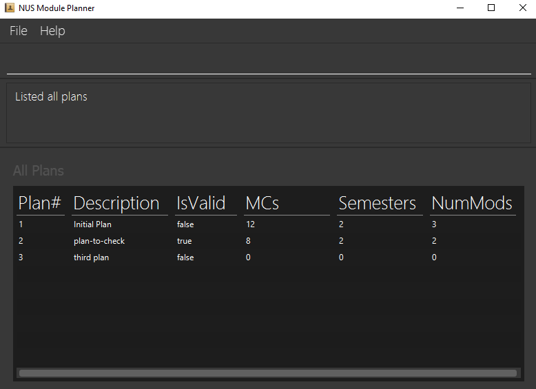

AddressBook Level 3 (AB3) is a **desktop app for managing contacts, optimized for use via a Command Line Interface** (CLI) while still having the benefits of a Graphical User Interface (GUI). If you can type fast, AB3 can get your contact management tasks done faster than traditional GUI apps.

- Table of Contents
  {:toc}

---

## Quick start

1. Ensure you have Java `11` or above installed in your Computer.

1. Download the latest `addressbook.jar` from [here](https://github.com/se-edu/addressbook-level3/releases).

1. Copy the file to the folder you want to use as the _home folder_ for your AddressBook.

1. Double-click the file to start the app. The GUI similar to the below should appear in a few seconds. Note how the app contains some sample data. 
   

1. Type the command in the command box and press Enter to execute it. e.g. typing **`help`** and pressing Enter will open the help window. 
   Some example commands you can try:

   - **`list`** : Lists all contacts.

   - **`add`**`n/John Doe p/98765432 e/johnd@example.com a/John street, block 123, #01-01` : Adds a contact named `John Doe` to the Address Book.

   - **`delete`**`3` : Deletes the 3rd contact shown in the current list.

   - **`clear`** : Deletes all contacts.

   - **`exit`** : Exits the app.

1. Refer to the [Features](#features) below for details of each command.

---

## Features

**:information_source: Notes about the command format:** 

- Words in `UPPER_CASE` are the parameters to be supplied by the user. 
  e.g. in `add n/NAME`, `NAME` is a parameter which can be used as `add n/John Doe`.

- Items in square brackets are optional. 
  e.g `n/NAME [t/TAG]` can be used as `n/John Doe t/friend` or as `n/John Doe`.

- Items with `…`​ after them can be used multiple times including zero times. 
  e.g. `[t/TAG]…​` can be used as ` ` (i.e. 0 times), `t/friend`, `t/friend t/family` etc.

- Parameters can be in any order. 
  e.g. if the command specifies `n/NAME p/PHONE_NUMBER`, `p/PHONE_NUMBER n/NAME` is also acceptable.

- If a parameter is expected only once in the command but you specified it multiple times, only the last occurrence of the parameter will be taken. 
  e.g. if you specify `p/12341234 p/56785678`, only `p/56785678` will be taken.

- Extraneous parameters for commands that do not take in parameters (such as `help`, `list`, `exit` and `clear`) will be ignored. 
  e.g. if the command specifies `help 123`, it will be interpreted as `help`.

### Viewing help : `help`

Shows a message explaning how to access the help page.

Format: `help`

### Check graduation : `validate plans`

Format: `validate plans [p/PLAN_NUMBER]`

When no PLAN_NUMBER is specified:

- Shows list of plans that are still valid
  - Each row is a plan
    - Each plan has 4 column attributes:
      - Shows plan number
      - Shows how many MCs the plan has
      - Shows how many MCs completed
      - Shows how many semesters remaining in plan

With `[p/PLAN_NUMBER]`

- Shows header
  - Shows plan number
  - Shows how many MCs the plan has
  - Shows how many MCs completed
  - Shows how many semesters remaining in plan
- Shows rows of modules placed in respective semesters
  - Shows X tables of X semesters
  - Each table has a header of how many MCs the semester will have
  - Each table shows module details

### Show history: `history`

Format: `history`

The above command takes no arguments and shows the user a list of modules that they have completed up until before the current semester.

The output format of history will follow the output format of show p/PLAN_NUMBER.

### List a summary of all plans: `list plans`

Format: `list plans`
Tip: A user can view an individual plan to see more details about it. (See show p/PLAN_NUMBER)

Format: `master p/PLAN_NUMBER`

This command must be done by the user at least once before they can use other commands.
Marks the given plan as the master plan, and this plan should contain all the modules that the user has taken (if any).

Example output:
[IMG]

### Create Plan: `add/delete`

Format: `add/delete p/PLAN_NUMBER`

#### Shows 2 rows

- Whether plan is added/deleted is successful/unsuccessful
- Plan number

#### Constraints

- Trying to add a plan that already exist will not be allowed
- Trying to delete a plan that does not exist will not be allowed

### Clearing all entries : `clear`

Clears all entries from the address book.

Format: `clear`

### Exiting the program : `exit`

Exits the program.

Format: `exit`

### Saving the data

Format: `current semester s/SEMESTER_NUMBER`

Marks the supplied semester as the current semester of the master plan.
This indicates that all previous semesters are part of the user’s history and all future semesters have yet to be attempted.
The user will have to manually update the current semester as time progresses.

Example output:
[IMG]

### Set plan as the master plan: `master`

Format: `master p/PLAN_NUMBER`

This command must be done by the user at least once before they can use other commands.
Marks the given plan as the master plan, and this plan should contain all the modules that the user has taken (if any).

Example output:
[IMG]

### Create history: `current semester`

Format: `current semester s/SEMESTER_NUMBER`

Marks the supplied semester as the current semester of the master plan.
This indicates that all previous semesters are part of the user’s history and all future semesters have yet to be attempted.
The user will have to manually update the current semester as time progresses.

Example output:
[IMG]
